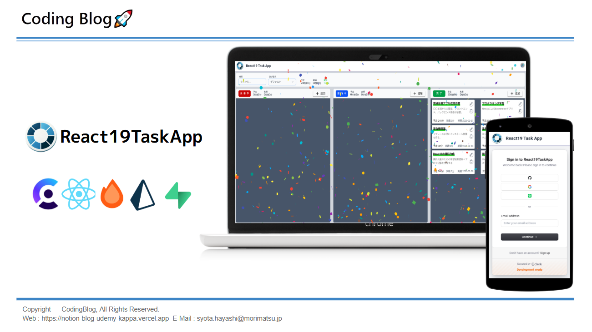
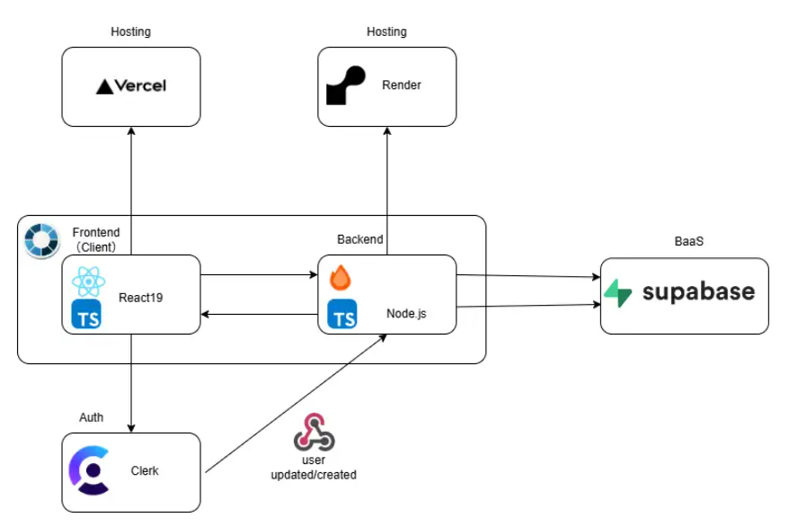

# 📋 React19TaskApp

React19 の Hooks を使用した認証付き DnD タスク管理アプリです。
React19、Clerk+Hono、Prisam+Supabase の学習のために作成しました。

---

## 🚀 アプリの紹介

[](https://www.youtube.com/watch?v=oGhOLMmW-e4)

デモ: [React19TaskApp を試す](https://react19-task-app-client.vercel.app/)

説明資料： [GoogleSlide を開く](https://docs.google.com/presentation/d/1qkqk8Rfvsz4jDaKrkNyvebYhixklNKejIz509w7UMcA/edit?usp=sharing)

---

## 🏗️ アーキテクチャ

デモのアーキテクチャ図はこちらです。

[](https://drive.google.com/file/d/19JtaahmuM0HnjqjOPhPWzF1LCISdDQZ5/view?usp=sharing)

---

## ✨ 主な機能

- 🔐 ユーザ認証（サインアップ・ログイン・ログアウト機能）
- ✅ タスクの追加・編集・削除
- 🧩 DND によるステータスの変更
- 💡 データベースに保存
- 📅 タスクの期限設定
- 🔍 タスクの検索・フィルタリング
- 📈 完了タスクの進捗率表示
- 🎉 タスク完了時のアニメーション

---

## 🛠️ 使用技術

- フロントエンド: React19
- バックエンド:Hono、Prisma
- データベース:Supabase
- 認証:Clerk
- スタイリング: Tailwind CSS
- 状態管理: ReduxToolKit
- ビルドツール: Vite

---

## ⚡ インストール方法

1. **リポジトリをクローン**

   ```bash
   git clone https://github.com/ShotaHayashi0601/React19TaskApp.git
   cd React19TaskApp
   ```

2. **依存関係をインストール**

   ```bash
   cd client
   npm i --legacy-peer-deps
   cd server
   npm i
   ```

### 3. **環境変数の設定**

`client` と `server` ディレクトリに `.env` ファイルを作成し、以下のように記述してください。

#### 📂 **client/.env**

| 変数名                       | 説明                          | 値の例                      |
| ---------------------------- | ----------------------------- | --------------------------- |
| `VITE_CLERK_PUBLISHABLE_KEY` | Clerk のパブリッシャブルキー  | `pk_test_xxxx`              |
| `VITE_API_BASE_URL`          | バックエンドの API ベース URL | `http://localhost:8787/api` |

```ini
# client/.env
VITE_CLERK_PUBLISHABLE_KEY=pk_test_xxxx
VITE_API_BASE_URL=http://localhost:8787/api
```

#### 📂 **server/.env**

| 変数名                  | 説明                         | 値の例                 |
| ----------------------- | ---------------------------- | ---------------------- |
| `DATABASE_URL`          | Supabase のデータベース URL  | `postgresql://...`     |
| `SIGNING_SECRET`        | Clerk 用の署名シークレット   | `clerk_signing_secret` |
| `CLERK_PUBLISHABLE_KEY` | Clerk のパブリッシャブルキー | `pk_test_xxxxx`        |
| `CLERK_SECRET_KEY`      | Clerk のシークレットキー     | `sk_test_xxxx`         |
| `PORT`                  | サーバー起動時のポート番号   | `8787`                 |

```ini
# server/.env
DATABASE_URL=postgresql://...
SIGNING_SECRET=clerk_signing_secret
CLERK_PUBLISHABLE_KEY=pk_test_xxxxx
CLERK_SECRET_KEY=sk_test_xxxx
PORT=8787
```

⚡ **注意:** `.env` ファイルは**絶対に Git にコミットしないでください**。次の設定を `.gitignore` に追加して保護します。

```gitignore
# .env
client/.env
server/.env
```

4. **ローカルサーバーを起動**
   ```bash
   npm run dev
   ```

ブラウザで `http://localhost:5173` にアクセスして確認できます。

---

## 🎮 使用方法

- [タスクを追加] ボタンをクリックして新しいタスクを作成。
- タスクをクリックして編集。
- タスクをドラッグアンドドロップしてタスクを完了状態に変更。
- 検索バーでタスクを検索。

---

## 👨‍💻 開発者

- **S.HCodeLv**
- 💼 [GitHub](https://github.com/ShotaHayashi0601)
- 📩 syota.hayashi@morimatsu.jp

---

✨ **このタスク管理アプリがあなたの学習の糧になることを祈っています！**
